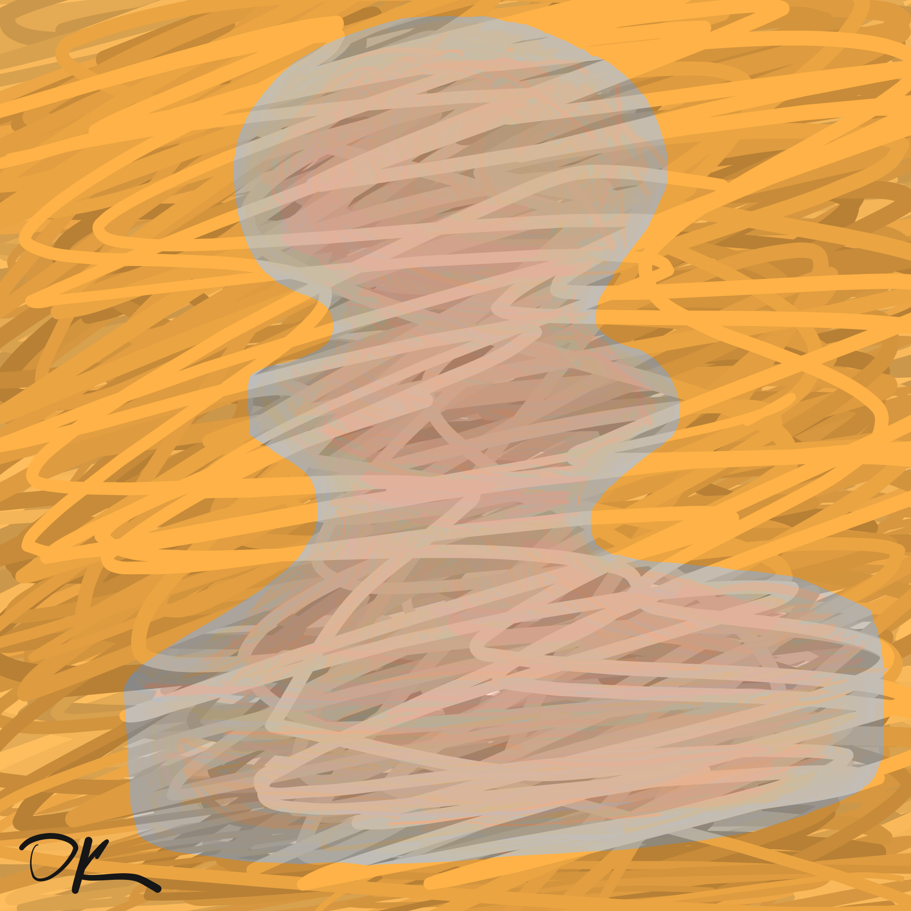

---
# Feel free to add content and custom Front Matter to this file.
# To modify the layout, see https://jekyllrb.com/docs/themes/#overriding-theme-defaults

layout: home
---

Welcome to my personal website!

{:refdef: style="text-align: center;"}
{:height="300px" width="232px" class="img-responsive" style="border-radius:20px"}&nbsp;&nbsp;&nbsp;&nbsp;
{:height="300px" width="232px" class="img-responsive" style="border-radius:20px" margin-right="50px"}&nbsp;&nbsp;&nbsp;&nbsp;
{:height="300px" width="232px" class="img-responsive" style="border-radius:20px"}
{: refdef}

Don't let anyone tell you differently—the pawn is the *most important piece* on the chess board.
